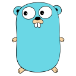

## Hi geeks!  My name is Hamid&nbsp;

I'm Hamid Gholami, a passionate self-taught SRE/DevOps engineer.

	
	

I am also an open-source and cloud enthusiast and maintainer. I learned a lot from the open-source community and I love how collaboration and knowledge sharing happened through open-source.

 

<h2 align="left" id="hamid-gholami-os">Favorite Operation System</h2>

> Operation systems (OS) that I like to work with.

<table>
  <tr>
  <td align="center"  width="96">
    
     Fedora
  </td>
  <td align="center"  width="96">
    
     Debian
  </td>
  <td align="center"  width="96">
    
     RHEL
  </td>
    <td align="center" width="96">
      
       Ubuntu
    </td>
    <td align="center"  width="96">
      
       Arch
    </td>
  </tr>
  </table>

<h2 align="left" id="hamid-gholami-tech">Favorite Tech</h2>

> Tools, languages, and other things that I like to work with.

<table>
  <tr>
    <td align="center" width="96">
      
       Ansible
    </td>
    <td align="center" width="96">
      
       Python
    </td>
    <td align="center" width="96">
      
       Go
    </td>
    <td align="center" width="96">
      
       Jenkins
    </td>
    <td align="center" width="96">
      
       Vue.js
    </td>
    <td align="center" width="96">
      
       Terraform
    </td>
    <td align="center" width="96">
      
       Vagrant
    </td>
    <td align="center" width="96">
      
       Git
    </td>
    <td align="center" width="96">
      
       django
    </td>
  </tr>
  <tr>
    <td align="center" width="96">
      
       Docker
    </td>
    <td align="center" width="96">
      
       Kubernetes
    </td>
    <td align="center"  width="96">
      
       Helm
    </td>
    <td align="center"  width="96">
      
       Bash
    </td>
    <td align="center" width="96">
      
       Vim
    </td>
    <td align="center"  width="96">
      
       OpenShift
    </td>
    <td align="center" width="96">
      
       Grafana
    </td>
    <td align="center" width="96">
      
       Prometheus
    </td>
    <td align="center" width="96">
      
       Istio
    </td>
  </tr>
  <tr>
    <td align="center" width="96">
      
       CRI-O
    </td>
    <td align="center" width="96">
      
       AWS
    </td>
    <td align="center"  width="96">
      
       puppet
    </td>
    <td align="center"  width="96">
      
       ceph
    </td>
    <td align="center" width="96">
      
       OpenStack
    </td>
    <td align="center"  width="96">
      
       GitHub
    </td>
    <td align="center" width="96">
      
       NGINX
    </td>
    <td align="center" width="96">
      
       HAProxy
    </td>
    <td align="center" width="96">
      
       GitLab
    </td>
  </tr>
</table>

   <i>It ain't about how hard you hit.</i>
    
   <i>It's about how hard you can get hit and keep moving forward.</i>
    
 
<a target="_blank" href="https://geekstyle.org/"></img></a>
<a target="_blank" href="https://www.linkedin.com/in/hamid-gholami"></img></a>
<a target="_blank" href="mailto:hidgholami@gmail.com"></img></a>
<a target="_blank" href="https://twitter.com/045_hamid"></img></a>
 

       
